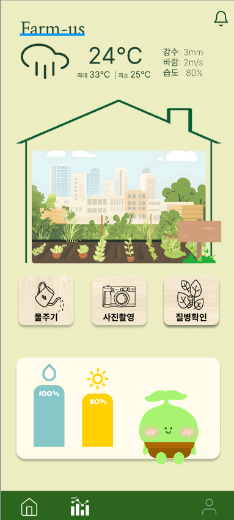
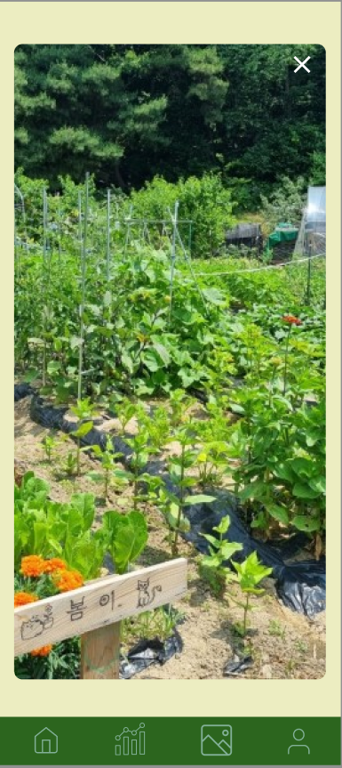
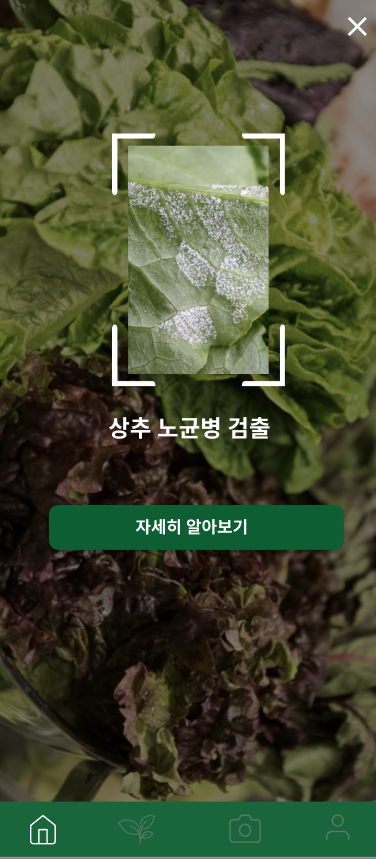

# 프로젝트명 : 팜요 Farm-yo

- 이미지
- 배포 URL : https://drive.google.com/file/d/1OseafIsXObwfuNPSEKQ_w3IaEkS9iNXR/view?usp=sharing
- Test ID : evilparan@gmail.com
- Test PW : farmustest1!

## 개요

 : 주말 농장을 이용하는 직장인, 가족들의 편의성을 증대하고, 농장주의 관리 효율을 높이는 스마트 텃밭 관리 프로젝트입니다.

## 기능

- 사용자 친화적인 앱을 통해 다양한 서비스를 제공합니다.
    1. 원격 급수
    2. 실시간 텃밭 CCTV
    3. 동물 침입, 도난 감지
    4. 추억 사진 촬영
    5. 질병 확인
    6. 수확시기 예측
    7. 날씨 및 토양 정보 제공
- 텃밭에 설치된 하드웨어를 통해 각종 정보를 수집합니다.
- 젯슨 나노를 통해 침입 동물, 도난을 온보드로 탐지합니다.

## 개발 환경

- AI : ResNet-152, CoAtNet-6, Coca
- Front : Android Kotlin
- Back : FastAPI, Spring, NGINX, Redis, MongoDB, Rabbit, Docker, Amazon EC2, Amazon S3
- Embedded : Jetson Nano, Raspberry Pi, Camera, IR Sensor
- Design : Figma
- 협업 툴 : Notion, Jira, Mattermost

## 기능 소개

## 시연 영상

    

    

    

### App

### Hardware

### AI

## Hardware

    

## Architecture

  

    
  

## ERD

  

    
  

### 개발 기간

- 2024-10-14 ~ 2024-11-22

### 팀 소개

<table>
  <tbody>
    <tr>
      <td align="center">
        
         
        <b>EM 팀장 : 이종하</b>
      </td>
      <td align="center">
        
         
        <b>BE : 서동인</b>
      </td>
      <td align="center">
        
         
        <b>FE : 오혜성</b>
      </td>
    </tr>
    <tr>
      <td>
        <ul>
          <li><strong>SSAFY 11th Embedded</strong></li>
          <li>역할1</li>
          <li>역할2</li>
        </ul>
      </td>
      <td>
        <ul>
          <li><strong>SSAFY 11th Java</strong></li>
          <li>RestAPI개발 및 mqtt서버 구축</li>
          <li>CI/CD 인프라 구축</li>
          <li>rtmp 미디어 서버 구축</li>
        </ul>
      </td>
      <td>
        <ul>
          <li><strong>SSAFY 11th Embedded</strong></li>
          <li>앱 설계</li>
          <li>앱 개발</li>
        </ul>
      </td>
    </tr>
    <tr>
      <td align="center">
        
         
        <b>EM : 여현대</b>
      </td>
      <td align="center">
        
         
        <b>BE : 박범수</b>
      </td>
      <td align="center">
        
         
        <b>FE : 강효린</b>
      </td>
    </tr>
    <tr>
      <td>
        <ul>
          <li><strong>SSAFY 11th Embedded</strong></li>
          <li>하드웨어 제작</li>
          <li>온습도 센서, 토양습도센서, 조도센서 값 측정</li>
          <li>rtmp 서버 전송</li>
        </ul>
      </td>
      <td>
        <ul>
          <li><strong>SSAFY 11th Java</strong></li>
          <li>역할1</li>
          <li>역할2</li>
        </ul>
      </td>
      <td>
        <ul>
          <li><strong>SSAFY 11th Embedded</strong></li>
          <li>역할1</li>
          <li>역할2</li>
        </ul>
      </td>
    </tr>
  </tbody>
</table>

### 트러블 슈팅

### 개선 목표

